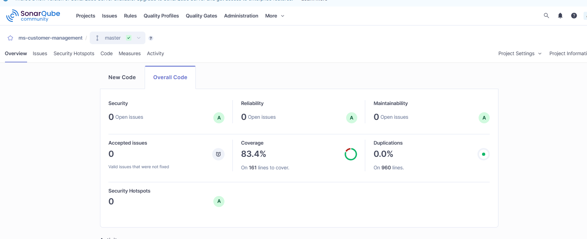

# MS Customer Management
Proyecto Spring Boot para la gestión de clientes

## Requisitos Previos
Antes de ejecutar el proyecto, asegúrate de tener instalado:
- Java 17
- Gradle 8+
- SQL Server
- Postman (opcional, para probar la colección)

## Configuración de la Base de Datos necesarias
- CREATE DATABASE db_customer_management;
- CREATE SCHEMA schema_customer;

## Configurar el application.yml con tus datos de conexion
- Tener en true la propiedad liquibase.enabled en el application.yml para que se apliquen los cambios de la base de datos al iniciar la aplicación.

## SonarQube (febrero 2026)
Comando para ejecutar sonar: gradlew clean build sonarqube -Dsonar.projectKey=ms-customer-management -Dsonar.token=$TOKEN -Dsonar.host.url=http://localhost:9000
Imagen de evidencia: 

## Postman
Archivo: gestion_clientes.postman_collection.json

### Endpoints Disponibles

**Headers requeridos en todas las peticiones:**
- `Transaccion-Id`: ID único de la transacción
- `Aplicacion-Id`: ID de la aplicación consumidora
- `Nombre-Aplicacion`: Nombre de la aplicación
- `Usuario-Consumidor-Id`: ID del usuario consumidor
- `Nombre-Servicio-Consumidor`: Nombre del servicio consumidor

#### 1. Crear Customer (POST)
```
POST http://localhost:8081/customers
Body (JSON):
{
  "documentType": "dni",
  "documentNumber": "4687794",
  "fullName": "marco",
  "email": "miraflores@gmail.com"
}
```

#### 2. Obtener Todos los Customers (GET)
```
GET http://localhost:8081/customers
```

#### 3. Obtener Customer por ID (GET)
```
GET http://localhost:8081/customers/{documentNumber}
Ejemplo: http://localhost:8081/customers/4687794
```

#### 4. Desactivar Customer (PATCH)
```
PATCH http://localhost:8081/customers/{documentNumber}/deactive
Ejemplo: http://localhost:8081/customers/4687794/deactive
```

## Modificaciones en la Base de Datos por medio de liquibase
Si se requiere modificar la estructura de la tabla de clientes:
1. Crear/actualizar el changelog de Liquibase.
2. Si los cambios afectan los campos de la entidad Java (CustomerEntity), actualizar también la clase para reflejar los cambios en la base de datos y evitar errores.
